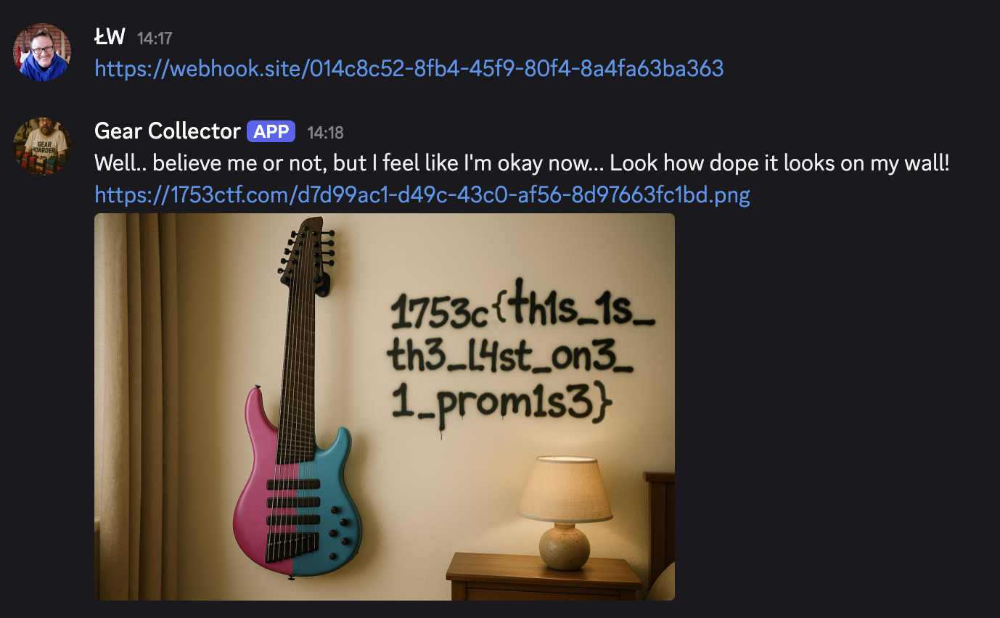

# GAS

🎸  Category: _MISC_
    
> I've heard there is a guy with gas joining this discord soon. Maybe we can help him a bit? https://youtu.be/QaxGfxIDK8M

## Discovery

The video attached to the challenge seems to explain that GAS is Gear Acquisition Syndrome which affects many musicians. Looking at Discord we can notice there is a bot user name Gear Collector.

Asking him what's up, we can get first assignment from him:

```
$ Gear Collector
Hey dude! I need your help. I am looking for a guitar, but not just any guitar. I need something special. Can you help me?
 
    P-Bass, by Fender
    Sunburst color
    20 frets
```

easy enough, we can find such guitar and send him...

https://kytary.pl/fender-player-precision-bass-mn-3ts/HN191923

and he is happy about it, and asks as for another piece of gear

```
$ Gear Collector
Wow, maaan! This is rad! I was looking for exacltly that... But I need one more.. just one more.. I promise..
 
    A stratocaster, but not by Fender.
    Something Japaneese.
    648 mm scale length.
    With both single coil and humbucker pickups.
```

A little more googling and we can sent him this

https://www.thomann.pl/yamaha_pacifica_112j_bl.htm

Then with the next one

```
$ Gear Collector
Wow, maaan! This is rad! I was looking for exacltly that... But I need one more.. just one more.. I promise..
 
    Bass with 2 humbuckers
    Indian Laurel fretboard
    Long scale
    Sunburst color
```

https://www.thomann.pl/epiphone_thunderbird_iv_ebass.htm

```
Wow, maaan! This is rad! I was looking for exacltly that... But I need one more.. just one more.. I promise..
 
    Short scale Bass
    Green
    4 strings
    2 humbuckers
    Bass VI body
    With pickup selector
```

https://midi.pl/gitary-basowe/200301-squier-paranormal-rascal-bass-shw-gitara-basowa-717669815554.html


```
Wow, maaan! This is rad! I was looking for exacltly that... But I need one more.. just one more.. I promise..
 
    A 9-strings bass
    Multiscale
    19 frets
    Ultra short scale
    3 single pickups
    Avtive electronics
    2-colour body, pink and blue
    Palisander fretboard
```

Well... 9 string bass? 2 colour body? Only 19 frets? Does not seem like something that can be found, right? I think something is off.

## Solution

Well, we have 2 issues:

1) We can't find a weird guitar he asks for
2) He works a bit unpredictibly sometimes not accepting clearly correct guitars

But.. this is not needed. Since the Gear Collector just looks at the link we send him, why not generate our own product page? For example:

```html
<h1>Killer Bass 3000<h1>
<p>A 9-strings bass</p>
<p>Multiscale</p>
<p>19 frets</p>
<p>Ultra short scale</p>
<p>3 single pickups</p>
<p>Avtive electronics</p>
<p>2-colour body, pink and blue</p>
<p>Palisander fretboard</p>

<h2>Buy now for $999</h2>
```

And then we can paste it on any hosting like github or webhook.site, providing such a link to our GAS guy. And... viola!



And the best thing is, we never needed to search for all these stores. We could fake them right from the start - thinking out of the box FTW!