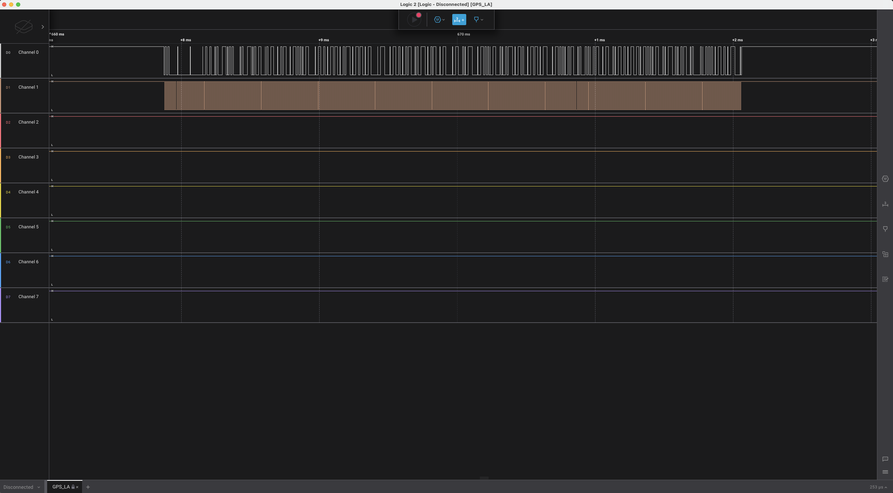
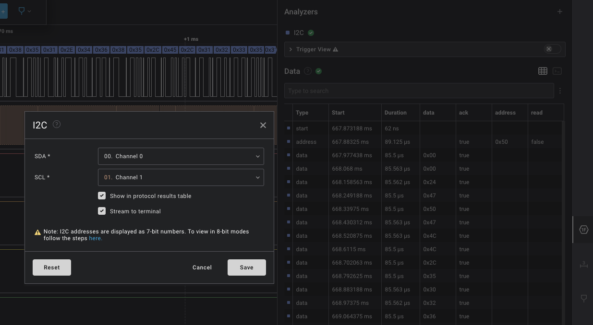
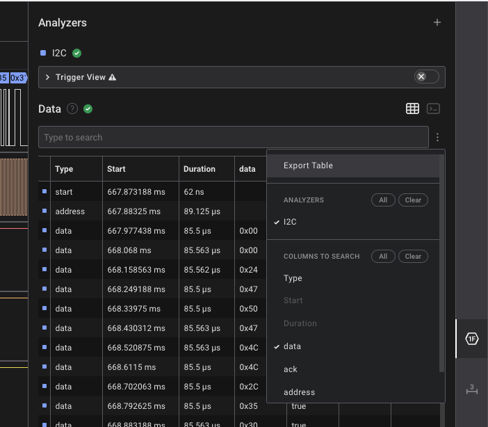
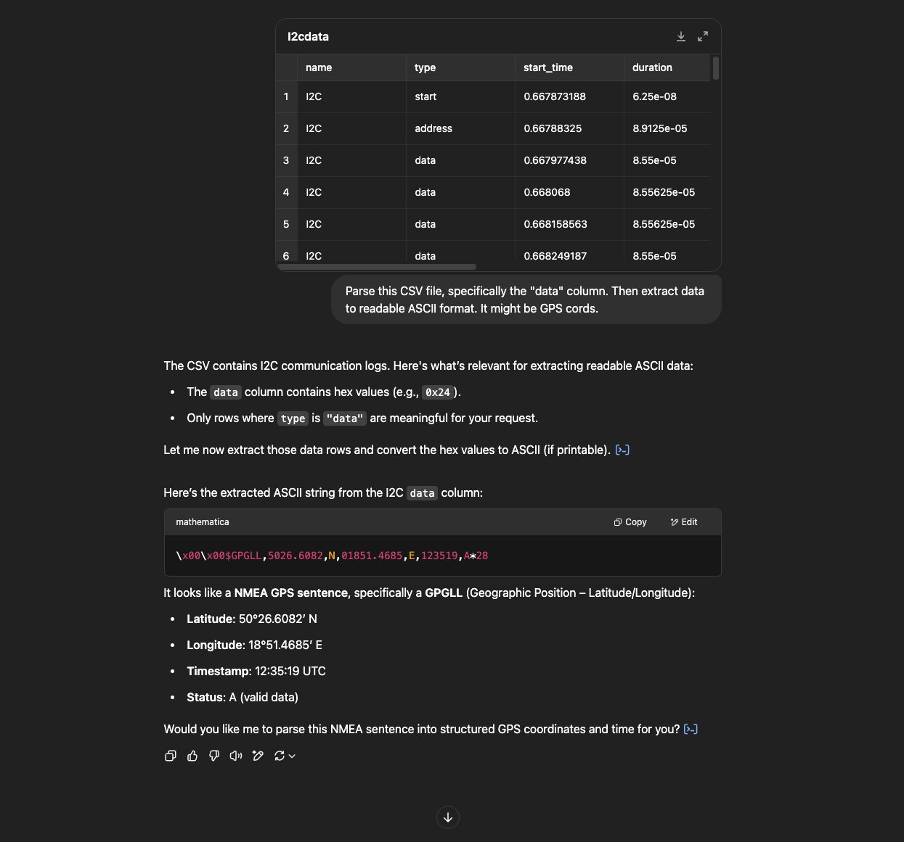
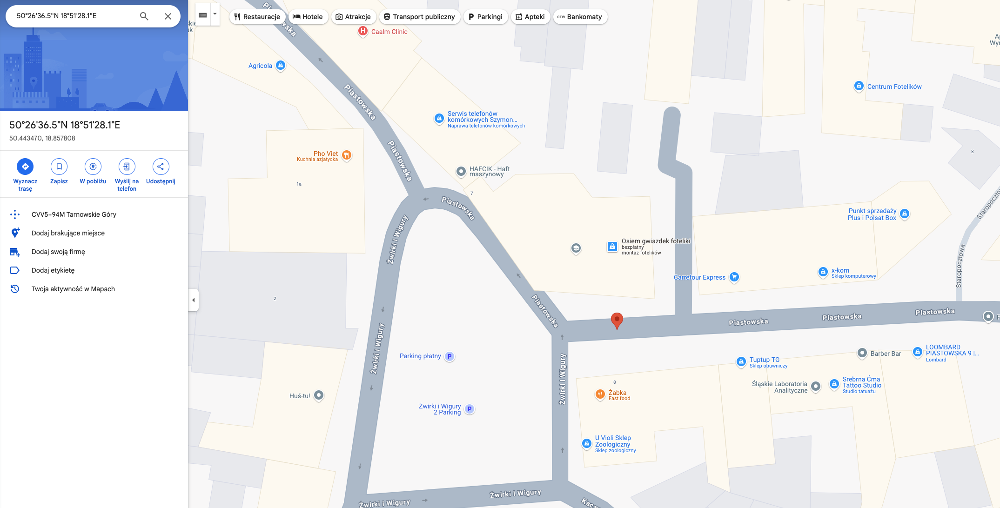

# Where did he go?

🛰 Category: _FORENSIC/OSINT_

> My shy friend won’t reveal where he takes his English lessons, but I managed to grab his GPS tracker. The device uses an AT24C32 chip to store the last known position. Help me recover the location from the memory dump and find out where he's been going.

## Discovery

The challenge includes a file from a Saleae logic analyzer which we need to open in Logic2 software.
After opening the file, we can see it contains a recording from two digital pins.

But what next? Let's find out!

## Solution

From the AT24C32 chip's datasheet we can see that it communicates via the I2C protocol
Now we can attach the correct analyzers

We need to export the binary information and parse it to get GPS coordinates.
In Logic2, there's an option to export data into csv file.

Then we'll use ChatGPT to parse CSV, especially the 'data' column, into a readable format.

We got these coordinates:

Latitude: 50°26.6082′ N
Longitude: 18°51.4685′ E

Let's put it into Google Maps!

Then, switch to the 3D view.

The description said something about taking English lessons. After a quick web check, we can see that "golden gate" is an English school, so we've got the flag! `1753c{golden_gate}`